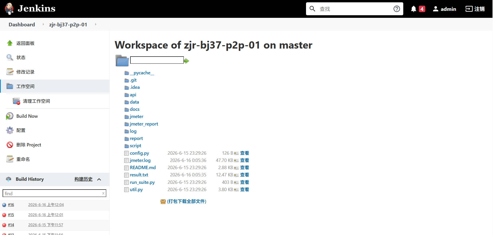
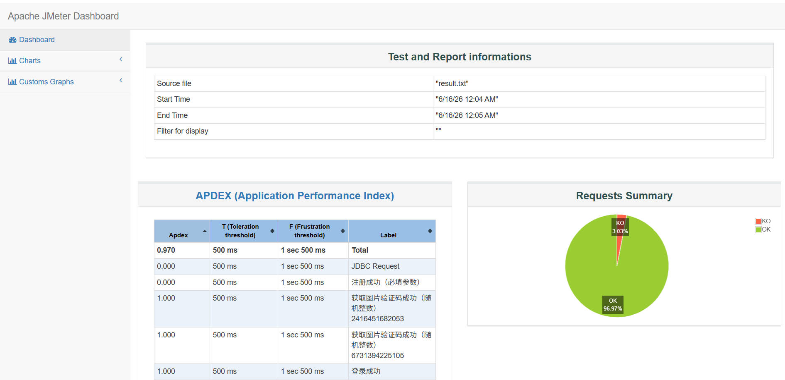
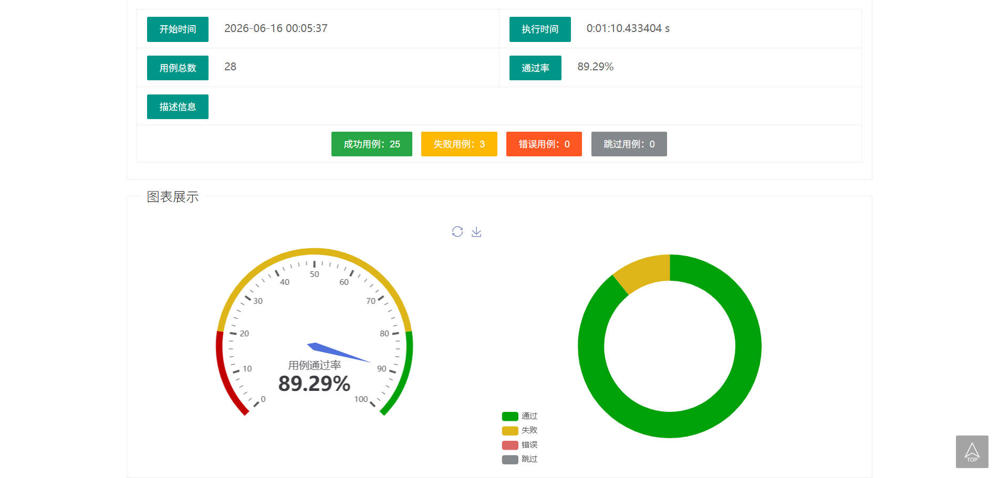

# P2P金融理财平台接口自动化测试项目

## 项目简介

本项目基于P2P借贷业务场景构建，模拟互联网金融理财平台的核心业务流程，涵盖借款人、投资人、运营管理员三类角色。

项目围绕借款申请、用户注册登录、实名认证、标的审核、投资理财、回款等核心业务开展测试工作，通过接口自动化测试与性能测试相结合的方式，对系统功能、业务逻辑及接口性能进行验证。

---

## 项目技术栈

* Python
* unittest
* Requests
* JMeter
* Jenkins
* MySQL
  
---

## 项目架构

```text
├─api                # 接口封装层
├─data               # 测试数据层
├─script             # 测试用例层
├─jmeter             # JMeter性能测试脚本
├─report             # 测试报告
├─log                # 日志文件
├─docs               # 测试分析图与测试用例
├─config.py          # 配置文件
├─util.py            # 公共工具类
└─run_suite.py       # 测试执行入口
```

---

## 测试覆盖范围

### 用户模块

* 用户注册
* 用户登录
* Session保持登录状态
* 参数校验
* 异常场景验证

### 审核模块

* 实名认证
* 借款申请审核
* 审核状态流转验证

### 投资模块

* 投资申请
* 余额校验
* 重复投资校验
* 投资记录查询

### 业务链路验证

借款人申请借款

↓

运营管理员审核借款

↓

投资人登录

↓

投资人投资标的

↓

投资记录查询

---

## 个人职责

### 测试分析与用例设计

* 梳理借款业务、投资业务正向及逆向测试场景
* 输出业务测试点分析图
* 编写功能测试用例及接口测试用例

### 接口自动化测试

* 基于 unittest + Requests 搭建接口自动化测试框架
* 实现接口封装、测试数据管理及日志记录
* 覆盖注册、登录、审核、投资等核心业务模块

### 性能测试

* 使用 JMeter 编写性能测试脚本
* 对登录、投资等核心接口进行并发性能测试
* 分析TPS、响应时间及错误率等关键指标

### 持续集成

* 配置 Jenkins 持续集成任务
* GitHub代码提交后自动触发测试执行
* 自动生成测试报告并输出测试结果

---

## 测试报告

项目支持自动生成HTML测试报告，用于展示测试执行结果、成功率及失败原因分析。

---

## 项目收获

* 熟悉互联网金融业务流程及测试方法
* 掌握接口自动化测试框架搭建流程
* 掌握 Requests、unittest 的实际应用
* 具备基础性能测试能力
* 了解 Jenkins 持续集成及自动化测试执行流程
  
---

## CI/CD持续集成
### 项目目录图

### JMeter生成测试报告

### unittest生成测试报告

